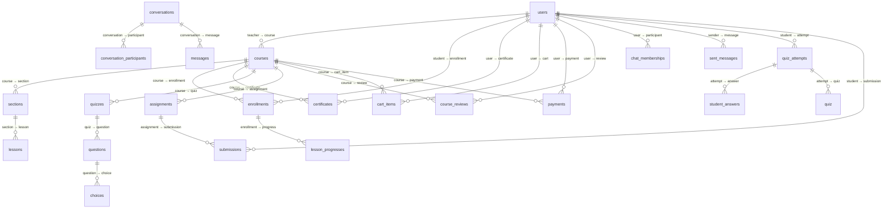
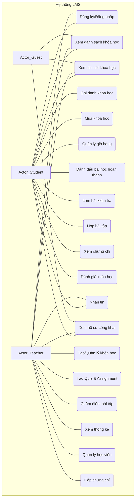
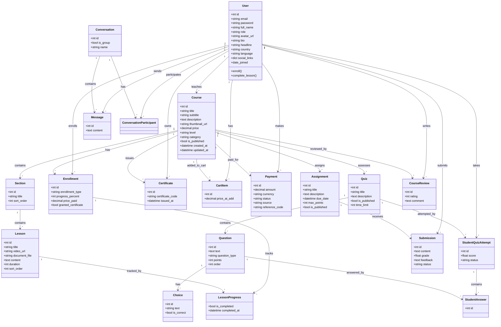
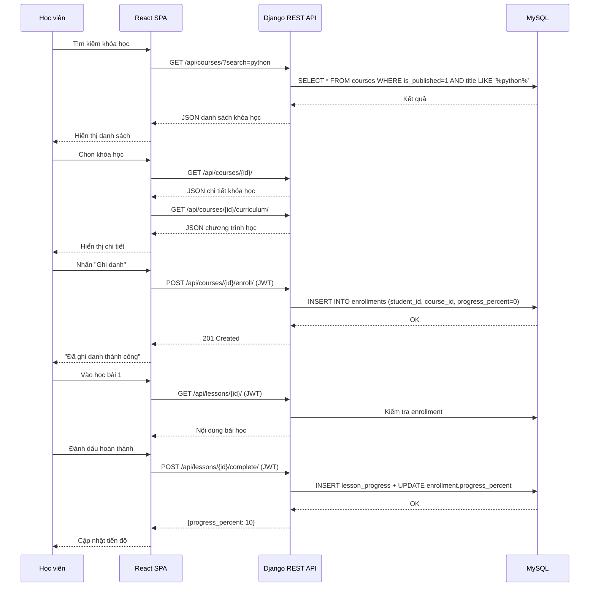
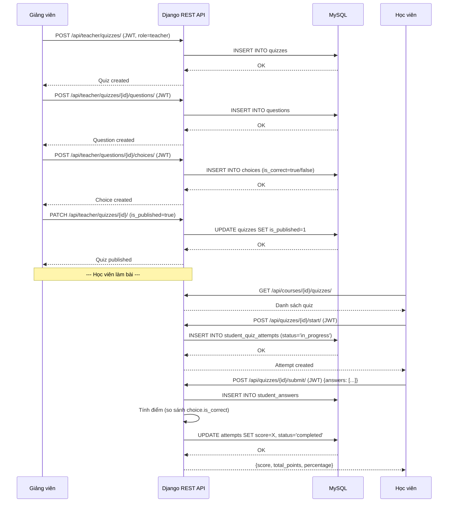
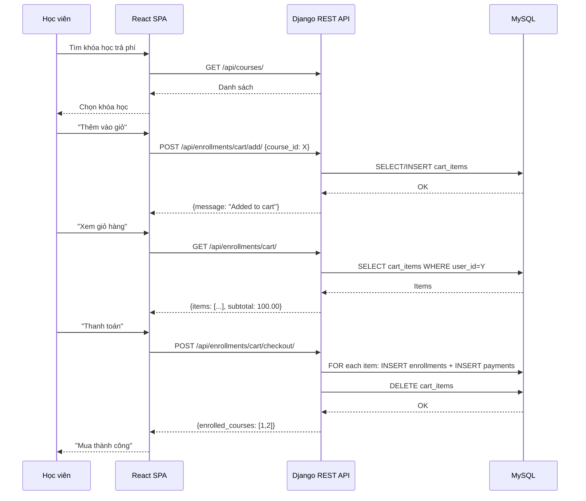
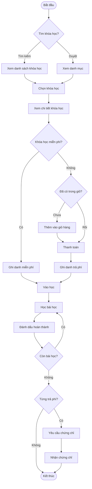
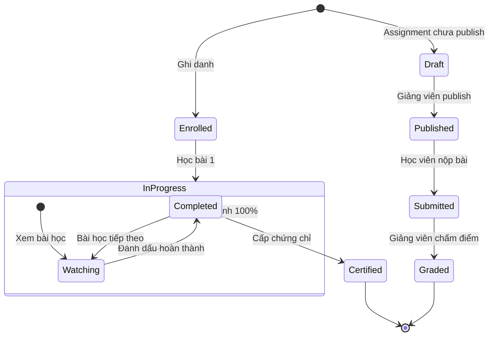

# Đặc tả Yêu cầu Phần mềm (SRS) — Hệ thống Quản lý Học tập LMS_DJANGO

> **Phiên bản:** 1.0  
> **Ngày:** 12/07/2026  
> **Tác giả:** @chienvoxn, @Dathless  
> **Tuân chuẩn:** IEEE 29148, IEEE 830

---

## Phần I — Giới thiệu (Introduction)

### 1. Mục đích tài liệu (Purpose)

Tài liệu này đặc tả chi tiết yêu cầu chức năng và phi chức năng cho hệ thống **LMS_DJANGO — Learning Management System**. Đây là tài liệu tham chiếu duy nhất cho đội ngũ phát triển, kiểm thử và các bên liên quan trong suốt vòng đời dự án.

### 2. Phạm vi sản phẩm (Scope)

**LMS_DJANGO** là một nền tảng học trực tuyến toàn diện cho phép:

- **Học viên (Student):** Đăng ký, tìm kiếm khóa học, ghi danh (miễn phí/trả phí), theo dõi tiến độ, làm bài kiểm tra/bài tập, nhận chứng chỉ, đánh giá khóa học, nhắn tin với giảng viên.
- **Giảng viên (Teacher/Instructor):** Tạo và quản lý khóa học (bài giảng, chương mục), tạo bài kiểm tra/bài tập, chấm điểm, quản lý học viên, xem thống kê phân tích.

**Nằm trong phạm vi:**

- Quản lý xác thực & phân quyền (JWT, role-based)
- Quản lý khóa học, chương, bài học
- Ghi danh & theo dõi tiến độ học tập
- Bài kiểm tra trắc nghiệm & bài tập tự luận
- Đánh giá/xếp hạng khóa học
- Giỏ hàng & thanh toán (mô phỏng)
- Chứng chỉ hoàn thành khóa học
- Nhắn tin thời gian thực
- Phân tích thống kê cho giảng viên
- Hồ sơ công khai cho học viên & giảng viên

**Ngoài phạm vi:**

- Tích hợp cổng thanh toán thật (Stripe/PayPal...)
- Hỗ trợ đa ngôn ngữ giao diện (frontend)
- Phát trực tiếp (livestream)
- Hệ thống thông báo push/email
- Thi hỗ trợ giám thị (proctoring)

### 3. Định nghĩa, từ viết tắt, thuật ngữ (Definitions, Acronyms)

| Thuật ngữ       | Giải thích                                    |
| --------------- | --------------------------------------------- |
| **SRS**         | Software Requirements Specification           |
| **JWT**         | JSON Web Token — xác thực người dùng          |
| **DRF**         | Django REST Framework                         |
| **CRUD**        | Create, Read, Update, Delete                  |
| **Role**        | Vai trò người dùng: student / teacher |
| **Enrollment**  | Ghi danh (bản ghi học viên tham gia khóa học) |
| **Section**     | Chương trong khóa học                         |
| **Lesson**      | Bài học trong chương                          |
| **Quiz**        | Bài kiểm tra trắc nghiệm                      |
| **Assignment**  | Bài tập tự luận/nộp file                      |
| **Submission**  | Bài nộp của học viên cho Assignment           |
| **Certificate** | Chứng chỉ hoàn thành khóa học                 |
| **CartItem**    | Mục trong giỏ hàng                            |
| **Payment**     | Giao dịch thanh toán                          |

### 4. Tài liệu tham khảo (References)

1. IEEE 29148-2018 — Systems and software engineering — Life cycle processes
2. IEEE 830-1998 — Recommended Practice for Software Requirements Specifications
3. Django REST Framework Documentation — https://www.django-rest-framework.org/
4. React Documentation — https://react.dev/
5. SimpleJWT Documentation — https://django-rest-framework-simplejwt.readthedocs.io/
6. Mã nguồn dự án: github.com/chienvoxn/LMS_DJANGO

### 5. Tổng quan tài liệu (Document Overview)

Tài liệu gồm 9 phần: Giới thiệu → Mô tả tổng quan → Yêu cầu chức năng → Yêu cầu phi chức năng → Thiết kế hệ thống & Kiến trúc → Sơ đồ UML → Ma trận truy vết → Kế hoạch kiểm thử → Phụ lục.

---

## Phần II — Mô tả tổng quan (Overall Description)

### 1. Bối cảnh sản phẩm (Product Perspective)

LMS_DJANGO là hệ thống mới phát triển từ đầu, kiến trúc **client-server** với:

- **Backend API:** Django REST Framework (Python) — cung cấp RESTful API
- **Frontend SPA:** React 18 + Vite + TailwindCSS — giao diện người dùng
- **Cơ sở dữ liệu:** MySQL 8.0+
- **Xác thực:** JWT (SimpleJWT) — access token 1 giờ, refresh token 7 ngày

Người dùng truy cập qua trình duyệt web. Frontend gọi API backend qua HTTP, backend trả JSON.

### 2. Chức năng chính của sản phẩm (Product Functions)

1. **Xác thực & quản lý người dùng** — đăng ký, đăng nhập, đổi mật khẩu, hồ sơ cá nhân
2. **Quản lý khóa học** — xem danh sách, chi tiết, tìm kiếm, lọc theo danh mục/cấp độ
3. **Quản lý chương/bài học** — CRUD chương, bài học (giảng viên)
4. **Ghi danh & theo dõi tiến độ** — ghi danh miễn phí/trả phí, đánh dấu bài học đã hoàn thành, tính % tiến độ
5. **Giỏ hàng & thanh toán** — thêm/xóa khóa học, checkout mô phỏng
6. **Bài kiểm tra (Quiz)** — tạo câu hỏi trắc nghiệm, làm bài, chấm điểm tự động
7. **Bài tập (Assignment)** — tạo bài tập, nộp bài, chấm điểm (giảng viên)
8. **Chứng chỉ** — cấp chứng chỉ khi hoàn thành khóa học trả phí
9. **Đánh giá khóa học** — xếp hạng 1-5 sao, bình luận
10. **Nhắn tin** — tạo hội thoại, gửi/nhận tin nhắn
11. **Phân tích** — thống kê tổng quan, theo khóa học, chuỗi thời gian, mức độ tương tác
12. **Hồ sơ công khai** — hồ sơ học viên & giảng viên (xem được mà không cần đăng nhập)

### 3. Đối tượng người dùng và đặc điểm (User Classes and Characteristics)

| Lớp người dùng        | Mô tả                     | Đặc điểm                                                                            |
| --------------------- | ------------------------- | ----------------------------------------------------------------------------------- |
| **Student**           | Học viên                  | Đăng ký tài khoản, ghi danh khóa học, làm bài kiểm tra, nộp bài tập, nhận chứng chỉ |
| **Teacher**           | Giảng viên                | Tạo/quản lý khóa học, bài kiểm tra, bài tập, chấm điểm, xem thống kê                |
| **Khách (Anonymous)** | Người dùng chưa đăng nhập | Xem danh sách khóa học, chi tiết khóa học, hồ sơ công khai                          |

### 4. Môi trường vận hành (Operating Environment)

- **Backend:** Python 3.10+, Django 5.2.7, MySQL 8.0+
- **Frontend:** Trình duyệt web hiện đại (Chrome, Firefox, Edge, Safari)
- **Development Server:** Django runserver (port 8000) + Vite dev server (port 3000)
- **Production:** Gunicorn/uWSGI + Nginx

### 5. Ràng buộc thiết kế/triển khai (Design and Implementation Constraints)

- Sử dụng Django REST Framework cho RESTful API
- Sử dụng React 18 + Vite cho frontend
- Xác thực JWT (SimpleJWT)
- Cơ sở dữ liệu MySQL (bắt buộc SSL)
- Tuân thủ PEP 8 (Python)
- CORS cho phép mọi origin ở môi trường phát triển

### 6. Giả định và phụ thuộc (Assumptions and Dependencies)

- **Giả định:** Người dùng có kết nối internet ổn định
- **Giả định:** Thanh toán được mô phỏng (không tích hợp cổng thanh toán thật)
- **Giả định:** MySQL đã được cài đặt và cấu hình
- **Phụ thuộc:** `django`, `djangorestframework`, `djangorestframework-simplejwt`, `mysqlclient`, `django-cors-headers`, `python-dotenv`
- **Phụ thuộc:** `react`, `react-router-dom`, `axios`, `recharts`, `tailwindcss`

---

## Phần III — Yêu cầu chức năng (Functional Requirements)

### Module 1: Xác thực & Quản lý Người dùng

#### FR-01: Đăng ký tài khoản

| Mục                      | Mô tả                                                                                                                                                                                                                                                                      |
| ------------------------ | -------------------------------------------------------------------------------------------------------------------------------------------------------------------------------------------------------------------------------------------------------------------------- |
| **Mã yêu cầu**           | FR-01                                                                                                                                                                                                                                                                      |
| **Mô tả**                | Người dùng mới đăng ký tài khoản với email, mật khẩu, họ tên, vai trò                                                                                                                                                                                                      |
| **Actor**                | Khách (Anonymous)                                                                                                                                                                                                                                                          |
| **Điều kiện tiên quyết** | Email chưa tồn tại trong hệ thống                                                                                                                                                                                                                                          |
| **Luồng chính**          | 1. Người dùng nhập email, password, password_confirm, full_name, role. 2. Hệ thống kiểm tra email unique. 3. Hệ thống kiểm tra password khớp. 4. Hệ thống tạo User mới với password đã hash. 5. Hệ thống sinh JWT tokens (access + refresh). 6. Trả về user info + tokens. |
| **Luồng thay thế**       | Email đã tồn tại → báo lỗi "A user with this email already exists". Password không khớp → báo lỗi "Passwords do not match".                                                                                                                                                |
| **Điều kiện sau**        | Tài khoản được tạo, người dùng tự động đăng nhập                                                                                                                                                                                                                           |
| **Business rules**       | Password tối thiểu 8 ký tự. Endpoint: `POST /api/auth/register/`                                                                                                                                                                                                           |

#### FR-02: Đăng nhập

| Mục                      | Mô tả                                                                                             |
| ------------------------ | ------------------------------------------------------------------------------------------------- |
| **Mã yêu cầu**           | FR-02                                                                                             |
| **Mô tả**                | Người dùng đăng nhập bằng email và password, nhận JWT tokens                                      |
| **Actor**                | Student, Teacher                                                                           |
| **Điều kiện tiên quyết** | Tài khoản đã tồn tại                                                                              |
| **Luồng chính**          | 1. Người dùng gửi email + password. 2. Hệ thống xác thực. 3. Trả về access_token + refresh_token. |
| **Luồng thay thế**       | Sai email/password → 401 Unauthorized                                                             |
| **Điều kiện sau**        | Access token có hiệu lực 1 giờ, refresh token 7 ngày                                              |
| **Business rules**       | Endpoint: `POST /api/auth/login/`                                                                 |

#### FR-03: Xem/Cập nhật hồ sơ cá nhân

| Mục                | Mô tả                                                                                                                       |
| ------------------ | --------------------------------------------------------------------------------------------------------------------------- |
| **Mã yêu cầu**     | FR-03                                                                                                                       |
| **Mô tả**          | Người dùng xem và cập nhật thông tin hồ sơ của mình (avatar, bio, headline, country, social_links)                          |
| **Actor**          | Student, Teacher                                                                                                            |
| **Luồng chính**    | 1. Người dùng gửi yêu cầu GET `users/me/profile/`. 2. Hệ thống trả về thông tin hồ sơ. 3. Người dùng PUT/PATCH để cập nhật. |
| **Điều kiện sau**  | Hồ sơ được cập nhật                                                                                                         |
| **Business rules** | Chỉ chủ sở hữu mới được cập nhật. Social_links phải là dict với các key mặc định.                                           |

#### FR-04: Xem hồ sơ công khai

| Mục                | Mô tả                                                                                                                                      |
| ------------------ | ------------------------------------------------------------------------------------------------------------------------------------------ |
| **Mã yêu cầu**     | FR-04                                                                                                                                      |
| **Mô tả**          | Xem hồ sơ công khai của học viên hoặc giảng viên mà không cần đăng nhập                                                                    |
| **Actor**          | Khách, Student, Teacher                                                                                                                    |
| **Endpoint**       | `GET /api/students/{id}/profile/`, `GET /api/instructors/{id}/profile/`                                                                    |
| **Luồng chính**    | 1. Người dùng gửi yêu cầu. 2. Hệ thống trả về thông tin + thống kê (số khóa học, số học viên, rating, v.v.)                                |
| **Business rules** | Giảng viên public profile gồm thống kê khóa học, rating, students. Học viên public profile gồm danh sách khóa học đã ghi danh kèm tiến độ. |

#### FR-05: Đổi mật khẩu

| Mục                | Mô tả                                                                                                              |
| ------------------ | ------------------------------------------------------------------------------------------------------------------ |
| **Mã yêu cầu**     | FR-05                                                                                                              |
| **Mô tả**          | Người dùng đã xác thực đổi mật khẩu                                                                                |
| **Actor**          | Student, Teacher                                                                                            |
| **Endpoint**       | `POST /api/auth/change-password/`                                                                                  |
| **Business rules** | Yêu cầu old_password + new_password. Mật khẩu mới phải khác mật khẩu cũ. Phải vượt qua Django password validators. |

---

### Module 2: Quản lý Khóa học

#### FR-06: Xem danh sách khóa học (công khai)

| Mục                | Mô tả                                                                                 |
| ------------------ | ------------------------------------------------------------------------------------- |
| **Mã yêu cầu**     | FR-06                                                                                 |
| **Mô tả**          | Xem danh sách khóa học đã xuất bản, hỗ trợ tìm kiếm, lọc theo category/level, sắp xếp |
| **Actor**          | Khách, Student, Teacher                                                        |
| **Endpoint**       | `GET /api/courses/`                                                                   |
| **Business rules** | Chỉ hiện khóa học có `is_published=True`. Phân trang 10 khóa học/trang.               |

#### FR-07: Xem chi tiết khóa học

| Mục            | Mô tả                                                                                             |
| -------------- | ------------------------------------------------------------------------------------------------- |
| **Mã yêu cầu** | FR-07                                                                                             |
| **Mô tả**      | Xem chi tiết khóa học gồm rating trung bình, số review, thông tin giảng viên, trạng thái ghi danh |
| **Actor**      | Khách, Student, Teacher                                                                           |
| **Endpoint**   | `GET /api/courses/{id}/`                                                                          |

#### FR-08: Xem chương trình học (curriculum)

| Mục            | Mô tả                                                                                                                              |
| -------------- | ---------------------------------------------------------------------------------------------------------------------------------- |
| **Mã yêu cầu** | FR-08                                                                                                                              |
| **Mô tả**      | Xem cấu trúc khóa học: danh sách chương (section) và bài học (lesson) trong từng chương, kèm trạng thái hoàn thành nếu đã ghi danh |
| **Actor**      | Khách (xem cấu trúc), Student (xem trạng thái hoàn thành)                                                                          |
| **Endpoint**   | `GET /api/courses/{id}/curriculum/`                                                                                                |

#### FR-09: Quản lý khóa học (Giảng viên)

| Mục                | Mô tả                                                                                                                                            |
| ------------------ | ------------------------------------------------------------------------------------------------------------------------------------------------ |
| **Mã yêu cầu**     | FR-09                                                                                                                                            |
| **Mô tả**          | Giảng viên tạo, xem, sửa, xóa khóa học của mình. Tạo, sửa, xóa chương và bài học.                                                                |
| **Actor**          | Teacher                                                                                                                                          |
| **Endpoints**      | `GET/POST /api/teacher/courses/`, `GET/PUT/PATCH/DELETE /api/teacher/courses/{id}/`, `POST /api/teacher/sections/`, `POST /api/teacher/lessons/` |
| **Business rules** | Chỉ giảng viên mới có quyền. Chỉ sửa/xóa khóa học của chính mình.                                                                                |

#### FR-10: Xem danh mục khóa học

| Mục            | Mô tả                                                           |
| -------------- | --------------------------------------------------------------- |
| **Mã yêu cầu** | FR-10                                                           |
| **Mô tả**      | Lấy danh sách các category duy nhất từ các khóa học đã xuất bản |
| **Actor**      | Khách                                                           |
| **Endpoint**   | `GET /api/courses/categories/`                                  |

#### FR-11: Xem chi tiết bài học (yêu cầu ghi danh)

| Mục                | Mô tả                                                        |
| ------------------ | ------------------------------------------------------------ |
| **Mã yêu cầu**     | FR-11                                                        |
| **Mô tả**          | Xem nội dung bài học. Yêu cầu học viên đã ghi danh khóa học. |
| **Actor**          | Student                                                      |
| **Endpoint**       | `GET /api/lessons/{id}/`                                     |
| **Business rules** | Permission denied nếu chưa ghi danh.                         |

---

### Module 3: Ghi danh & Tiến độ

#### FR-12: Ghi danh khóa học miễn phí

| Mục                      | Mô tả                                                          |
| ------------------------ | -------------------------------------------------------------- |
| **Mã yêu cầu**           | FR-12                                                          |
| **Mô tả**                | Học viên ghi danh vào khóa học miễn phí                        |
| **Actor**                | Student                                                        |
| **Endpoint**             | `POST /api/courses/{course_id}/enroll/`                        |
| **Điều kiện tiên quyết** | Khóa học tồn tại và đã xuất bản. Người dùng có role 'student'. |
| **Luồng thay thế**       | Đã ghi danh → báo lỗi "You are already enrolled"               |

#### FR-13: Ghi danh khóa học trả phí / Audit

| Mục                | Mô tả                                                                                            |
| ------------------ | ------------------------------------------------------------------------------------------------ |
| **Mã yêu cầu**     | FR-13                                                                                            |
| **Mô tả**          | Học viên mua khóa học (paid) hoặc ghi danh kiểu audit (miễn phí nhưng không được cấp chứng chỉ). |
| **Actor**          | Student                                                                                          |
| **Endpoint**       | `POST /api/courses/{course_id}/purchase/`                                                        |
| **Body**           | `{"mode": "audit" \| "paid"}`                                                                    |
| **Business rules** | Có thể nâng cấp từ audit lên paid. Không thể mua khóa học của chính mình.                        |

#### FR-14: Đánh dấu bài học hoàn thành

| Mục               | Mô tả                                                                                        |
| ----------------- | -------------------------------------------------------------------------------------------- |
| **Mã yêu cầu**    | FR-14                                                                                        |
| **Mô tả**         | Học viên đánh dấu bài học đã hoàn thành. Hệ thống tự động tính % tiến độ khóa học.           |
| **Actor**         | Student                                                                                      |
| **Endpoint**      | `POST /api/lessons/{lesson_id}/complete/`                                                    |
| **Điều kiện sau** | `progress_percent` của Enrollment được cập nhật = (completed_lessons / total_lessons) \* 100 |

#### FR-15: Xem khóa học của tôi

| Mục            | Mô tả                                                                         |
| -------------- | ----------------------------------------------------------------------------- |
| **Mã yêu cầu** | FR-15                                                                         |
| **Mô tả**      | Xem danh sách khóa học đã ghi danh kèm tiến độ, bài học cuối cùng đã truy cập |
| **Actor**      | Student                                                                       |
| **Endpoint**   | `GET /api/student/my-courses/`                                                |

#### FR-16: Xem danh sách học viên (Giảng viên)

| Mục              | Mô tả                                                                                                             |
| ---------------- | ----------------------------------------------------------------------------------------------------------------- |
| **Mã yêu cầu**   | FR-16                                                                                                             |
| **Mô tả**        | Giảng viên xem danh sách học viên trong khóa học của mình, kèm tiến độ, số bài kiểm tra đã làm, số bài tập đã nộp |
| **Actor**        | Teacher                                                                                                           |
| **Endpoint**     | `GET /api/teacher/courses/{course_id}/students/`                                                                  |
| **Query params** | `q` (tìm kiếm theo tên/email), `status` (completed/in_progress)                                                   |

#### FR-17: Xóa học viên khỏi khóa học

| Mục            | Mô tả                                                                                                            |
| -------------- | ---------------------------------------------------------------------------------------------------------------- |
| **Mã yêu cầu** | FR-17                                                                                                            |
| **Mô tả**      | Giảng viên xóa học viên khỏi khóa học (và xóa toàn bộ dữ liệu liên quan: tiến độ bài học, bài kiểm tra, bài tập) |
| **Actor**      | Teacher                                                                                                          |
| **Endpoint**   | `DELETE /api/teacher/courses/{course_id}/students/{student_id}/`                                                 |

---

### Module 4: Giỏ hàng & Thanh toán

#### FR-18: Quản lý giỏ hàng

| Mục                | Mô tả                                                                                                       |
| ------------------ | ----------------------------------------------------------------------------------------------------------- |
| **Mã yêu cầu**     | FR-18                                                                                                       |
| **Mô tả**          | Học viên xem giỏ hàng, thêm khóa học, xóa khóa học khỏi giỏ                                                 |
| **Actor**          | Student                                                                                                     |
| **Endpoints**      | `GET /api/enrollments/cart/`, `POST /api/enrollments/cart/add/`, `DELETE /api/enrollments/cart/items/{id}/` |
| **Business rules** | Không thể thêm khóa học của chính mình. Không thể thêm khóa học đã sở hữu.                                  |

#### FR-19: Thanh toán giỏ hàng

| Mục                | Mô tả                                                                                            |
| ------------------ | ------------------------------------------------------------------------------------------------ |
| **Mã yêu cầu**     | FR-19                                                                                            |
| **Mô tả**          | Học viên thanh toán toàn bộ hoặc một số mục trong giỏ hàng (mô phỏng — tạo Enrollment + Payment) |
| **Actor**          | Student                                                                                          |
| **Endpoint**       | `POST /api/enrollments/cart/checkout/`                                                           |
| **Business rules** | Thanh toán luôn thành công (mô phỏng). Tạo Payment record với status="succeeded".                |

#### FR-20: Xem lịch sử thanh toán

| Mục            | Mô tả                                 |
| -------------- | ------------------------------------- |
| **Mã yêu cầu** | FR-20                                 |
| **Mô tả**      | Xem lịch sử thanh toán của người dùng |
| **Actor**      | Student                               |
| **Endpoint**   | `GET /api/enrollments/me/payments/`   |

---

### Module 5: Bài kiểm tra (Quiz)

#### FR-21: Quản lý Quiz (Giảng viên)

| Mục                | Mô tả                                                                                                                                                         |
| ------------------ | ------------------------------------------------------------------------------------------------------------------------------------------------------------- |
| **Mã yêu cầu**     | FR-21                                                                                                                                                         |
| **Mô tả**          | Giảng viên CRUD quiz, thêm/sửa/xóa câu hỏi và lựa chọn                                                                                                        |
| **Actor**          | Teacher                                                                                                                                                       |
| **Endpoints**      | `POST /api/teacher/quizzes/`, `POST /api/teacher/quizzes/{id}/questions/`, `POST /api/teacher/questions/{id}/choices/`, các endpoint GET/PUT/DELETE tương ứng |
| **Business rules** | Quiz gắn với một khóa học nhất định. Chỉ tạo cho khóa học của chính mình.                                                                                     |

#### FR-22: Làm bài kiểm tra (Học viên)

| Mục                | Mô tả                                                                                                                                                                                                                  |
| ------------------ | ---------------------------------------------------------------------------------------------------------------------------------------------------------------------------------------------------------------------- |
| **Mã yêu cầu**     | FR-22                                                                                                                                                                                                                  |
| **Mô tả**          | Học viên xem danh sách quiz, bắt đầu làm quiz, nộp bài và nhận điểm tự động                                                                                                                                            |
| **Actor**          | Student                                                                                                                                                                                                                |
| **Endpoints**      | `GET /api/courses/{id}/quizzes/` → `GET /api/quizzes/{id}/` → `POST /api/quizzes/{id}/start/` → `POST /api/quizzes/{id}/submit/`                                                                                       |
| **Luồng chính**    | 1. Xem danh sách quiz đã xuất bản → 2. Xem chi tiết quiz (câu hỏi, không hiện đáp án đúng) → 3. Bắt đầu attempt (nếu chưa có attempt đang làm dở) → 4. Nộp bài (gửi danh sách answers) → 5. Hệ thống tự động chấm điểm |
| **Business rules** | StudentAnswer không hiện `is_correct` khi làm bài. Quiz được chấm dựa trên tổng điểm các câu đúng.                                                                                                                     |

#### FR-23: Xem lịch sử làm quiz

| Mục            | Mô tả                                     |
| -------------- | ----------------------------------------- |
| **Mã yêu cầu** | FR-23                                     |
| **Mô tả**      | Xem các lần làm bài kiểm tra của bản thân |
| **Actor**      | Student                                   |
| **Endpoint**   | `GET /api/quizzes/{id}/attempts/me/`      |

---

### Module 6: Bài tập (Assignment)

#### FR-24: Quản lý Assignment (Giảng viên)

| Mục            | Mô tả                                                                                                                                              |
| -------------- | -------------------------------------------------------------------------------------------------------------------------------------------------- |
| **Mã yêu cầu** | FR-24                                                                                                                                              |
| **Mô tả**      | Giảng viên CRUD assignment, xem bài nộp của học viên, chấm điểm                                                                                    |
| **Actor**      | Teacher                                                                                                                                            |
| **Endpoints**  | Teacher CRUD: `POST/GET /api/teacher/assignments/`, `GET /api/teacher/assignments/{id}/submissions/`, `PATCH /api/teacher/submissions/{id}/grade/` |

#### FR-25: Nộp bài tập (Học viên)

| Mục                | Mô tả                                                                            |
| ------------------ | -------------------------------------------------------------------------------- |
| **Mã yêu cầu**     | FR-25                                                                            |
| **Mô tả**          | Học viên nộp bài tập, xem lại bài nộp và điểm                                    |
| **Actor**          | Student                                                                          |
| **Endpoints**      | `POST /api/assignments/{id}/submit/`, `GET /api/assignments/{id}/my-submission/` |
| **Business rules** | Mỗi học viên chỉ nộp một lần. Nếu đã chấm điểm (graded) thì không thể sửa.       |

#### FR-26: Upload file

| Mục            | Mô tả                                                                                        |
| -------------- | -------------------------------------------------------------------------------------------- |
| **Mã yêu cầu** | FR-26                                                                                        |
| **Mô tả**      | Upload file lên server, trả về URL (dùng cho assignment submission, lesson document, avatar) |
| **Actor**      | Student, Teacher                                                                             |
| **Endpoint**   | `POST /api/upload/`                                                                          |

---

### Module 7: Chứng chỉ

#### FR-27: Cấp chứng chỉ

| Mục                      | Mô tả                                                                        |
| ------------------------ | ---------------------------------------------------------------------------- |
| **Mã yêu cầu**           | FR-27                                                                        |
| **Mô tả**                | Học viên yêu cầu cấp chứng chỉ sau khi hoàn thành khóa học trả phí           |
| **Actor**                | Student                                                                      |
| **Endpoint**             | `POST /api/courses/{course_id}/certificate/issue/`                           |
| **Điều kiện tiên quyết** | Enrollment type = 'paid', đã hoàn thành 100% bài học                         |
| **Điều kiện sau**        | Certificate được tạo với mã code UUID. enrollment.granted_certificate = True |

#### FR-28: Xem chứng chỉ

| Mục            | Mô tả                                                                                   |
| -------------- | --------------------------------------------------------------------------------------- |
| **Mã yêu cầu** | FR-28                                                                                   |
| **Mô tả**      | Xem chứng chỉ của một khóa học hoặc danh sách chứng chỉ                                 |
| **Actor**      | Student                                                                                 |
| **Endpoints**  | `GET /api/courses/{course_id}/certificate/me/`, `GET /api/enrollments/me/certificates/` |

---

### Module 8: Đánh giá khóa học

#### FR-29: Đánh giá khóa học

| Mục                | Mô tả                                                                                   |
| ------------------ | --------------------------------------------------------------------------------------- |
| **Mã yêu cầu**     | FR-29                                                                                   |
| **Mô tả**          | Học viên tạo/cập nhật/xóa đánh giá (rating 1-5 + bình luận) cho khóa học đã ghi danh    |
| **Actor**          | Student                                                                                 |
| **Endpoints**      | `GET/POST /api/courses/{course_id}/reviews/`, `GET/PUT/PATCH/DELETE /api/reviews/{id}/` |
| **Business rules** | Mỗi học viên chỉ một review mỗi khóa học. Yêu cầu đã ghi danh.                          |

#### FR-30: Xem rating tổng quan

| Mục            | Mô tả                                                |
| -------------- | ---------------------------------------------------- |
| **Mã yêu cầu** | FR-30                                                |
| **Mô tả**      | Xem rating trung bình và tổng số review của khóa học |
| **Actor**      | Khách                                                |
| **Endpoint**   | `GET /api/courses/{course_id}/rating-summary/`       |

---

### Module 9: Nhắn tin

#### FR-31: Quản lý hội thoại

| Mục                | Mô tả                                                                              |
| ------------------ | ---------------------------------------------------------------------------------- |
| **Mã yêu cầu**     | FR-31                                                                              |
| **Mô tả**          | Xem danh sách hội thoại, tạo hội thoại mới (1-1 hoặc nhóm)                         |
| **Actor**          | Student, Teacher                                                                   |
| **Endpoints**      | `GET/POST /api/chat/conversations/`, `GET /api/chat/conversations/{id}/`           |
| **Business rules** | Hội thoại 1-1 tự động tái sử dụng nếu đã tồn tại. Hội thoại nhóm khi có > 2 người. |

#### FR-32: Gửi & nhận tin nhắn

| Mục                | Mô tả                                                |
| ------------------ | ---------------------------------------------------- |
| **Mã yêu cầu**     | FR-32                                                |
| **Mô tả**          | Gửi tin nhắn trong hội thoại, xem danh sách tin nhắn |
| **Actor**          | Student, Teacher                                     |
| **Endpoints**      | `GET/POST /api/chat/conversations/{id}/messages/`    |
| **Business rules** | Chỉ thành viên hội thoại mới xem/gửi tin nhắn.       |

---

### Module 10: Phân tích

#### FR-33: Thống kê tổng quan (Giảng viên)

| Mục            | Mô tả                                                                                                           |
| -------------- | --------------------------------------------------------------------------------------------------------------- |
| **Mã yêu cầu** | FR-33                                                                                                           |
| **Mô tả**      | Xem thống kê tổng quan: tổng khóa học, tổng ghi danh, tổng học viên, rating trung bình, doanh thu, số chứng chỉ |
| **Actor**      | Teacher                                                                                                         |
| **Endpoint**   | `GET /api/teacher/analytics/summary/`                                                                           |

#### FR-34: Thống kê theo khóa học

| Mục            | Mô tả                                                                      |
| -------------- | -------------------------------------------------------------------------- |
| **Mã yêu cầu** | FR-34                                                                      |
| **Mô tả**      | Thống kê chi tiết từng khóa học: số ghi danh, rating, doanh thu, chứng chỉ |
| **Actor**      | Teacher                                                                    |
| **Endpoint**   | `GET /api/teacher/analytics/courses/`                                      |

#### FR-35: Dữ liệu chuỗi thời gian & Tương tác

| Mục            | Mô tả                                                                                                      |
| -------------- | ---------------------------------------------------------------------------------------------------------- |
| **Mã yêu cầu** | FR-35                                                                                                      |
| **Mô tả**      | Xem biểu đồ ghi danh theo thời gian và các chỉ số tương tác (bài kiểm tra, bài tập, bài học đã hoàn thành) |
| **Actor**      | Teacher                                                                                                    |
| **Endpoints**  | `GET /api/teacher/analytics/timeseries/`, `GET /api/teacher/analytics/engagement/`                         |

---

### Module 11: Top Instructors

#### FR-36: Top giảng viên

| Mục            | Mô tả                                                  |
| -------------- | ------------------------------------------------------ |
| **Mã yêu cầu** | FR-36                                                  |
| **Mô tả**      | Xem top 10 giảng viên xếp theo số học viên hoặc rating |
| **Actor**      | Khách                                                  |
| **Endpoint**   | `GET /api/instructors/top/?sort=students\|rating`      |

---

## Phần IV — Yêu cầu phi chức năng (Non-Functional Requirements)

### NFR-01: Hiệu năng (Performance)

- Thời gian phản hồi API trung bình < 500ms (với 100 request đồng thời)
- Phân trang mặc định 10 bản ghi/trang
- Sử dụng `select_related`, `prefetch_related` để tối ưu truy vấn database
- Frontend SPA giảm tải server rendering

### NFR-02: Bảo mật (Security)

- **Xác thực:** JWT (SimpleJWT) — access token 1 giờ, refresh token 7 ngày
- **Phân quyền:** Role-based (student/teacher) qua custom permissions `IsTeacher`, `IsOwnerOrReadOnly`
- **Mật khẩu:** Hash bằng Django PBKDF2; validation (min length, không trùng với username/email)
- **CSRF:** Django CSRF middleware
- **CORS:** Cấu hình linh hoạt (AllowAll ở dev, whitelist ở production)
- **File upload:** Lưu trữ trên server, tên file unique (UUID)

### NFR-03: Khả năng mở rộng (Scalability)

- Kiến trúc RESTful stateless — dễ dàng scale ngang backend
- Database indexing trên các field thường xuyên truy vấn (email, course**id, user**id)
- Frontend SPA tĩnh có thể deploy qua CDN

### NFR-04: Độ tin cậy & Sẵn sàng (Reliability/Availability)

- MySQL với SSL connection
- Logging cấu hình sẵn (console, level INFO)
- Xử lý lỗi đồng nhất: trả về JSON với success/error/details

### NFR-05: Khả năng bảo trì (Maintainability)

- Kiến trúc Django app (module hóa): users, courses, enrollments, assessments, reviews, analytics, chat
- PEP 8 coding style
- DRF ViewSets cho CRUD chuẩn hóa
- Environment variables qua `.env` (python-dotenv)

### NFR-06: Khả năng tương thích (Compatibility)

- Backend: Python 3.10+, Django 5.2+
- Frontend: React 18+, Chrome/Firefox/Edge/Safari
- Database: MySQL 8.0+
- API trả về JSON, RESTful

### NFR-07: Usability/UX

- Giao diện responsive nhờ TailwindCSS
- Phân trang, tìm kiếm, lọc dễ dàng
- Thông báo lỗi rõ ràng bằng tiếng Anh (trong API response)
- Giao diện Login/Register riêng biệt

### NFR-08: Tuân thủ pháp lý

- Mật khẩu được lưu trữ hash (không plaintext)
- API yêu cầu xác thực cho dữ liệu nhạy cảm
- _(Giả định cần xác nhận: Chưa có GDPR/PCI-DSS vì thanh toán mô phỏng)_

---

## Phần V — Thiết kế hệ thống & Kiến trúc kỹ thuật

### 1. Kiến trúc tổng thể (Architecture Overview)

```
┌─────────────────────────────────────────────────────────────────┐
│                    Client (Browser)                             │
│  ┌────────────────────────────────────────────────────────┐    │
│  │            React SPA (Vite + TailwindCSS)              │    │
│  │  ┌─────────┐ ┌──────────┐ ┌────────┐ ┌───────────┐  │    │
│  │  │ Auth    │ │ Courses  │ │ Quiz   │ │ Chat      │  │    │
│  │  │ Pages   │ │ Pages    │ │ Pages  │ │ Pages     │  │    │
│  │  └────┬────┘ └────┬─────┘ └───┬────┘ └─────┬─────┘  │    │
│  │       └───────┬───┴───────────┴────────────┘         │    │
│  │               │ Axios HTTP Client                     │    │
│  └───────────────┼────────────────────────────────────────┘    │
└──────────────────┼─────────────────────────────────────────────┘
                   │ HTTP/REST JSON
                   │ Authorization: Bearer <JWT>
┌──────────────────┼─────────────────────────────────────────────┐
│  ┌───────────────┴────────────────────────────────────────┐   │
│  │              Django REST Framework (port 8000)          │   │
│  │  ┌─────────┐ ┌────────────┐ ┌───────┐ ┌────────┐     │   │
│  │  │ users/  │ │ courses/   │ │assess-│ │ chat/  │     │   │
│  │  │ auth    │ │ sections   │ │ments/ │ │ convs  │     │   │
│  │  │ profile │ │ lessons    │ │quizzes│ │ msgs   │     │   │
│  │  ├─────────┤ ├────────────┤ ├───────┤ ├────────┤     │   │
│  │  │enroll-  │ │ reviews/   │ │analy- │ │common/ │     │   │
│  │  │ments/   │ │ course_rev │ │tics/  │ │permiss │     │   │
│  │  │ progress│ │            │ │ stats │ │        │     │   │
│  │  │ cart    │ │            │ │       │ │        │     │   │
│  │  │ payments│ │            │ │       │ │        │     │   │
│  │  └─────────┘ └────────────┘ └───────┘ └────────┘     │   │
│  └────────────────────────────────────────────────────────┘   │
│                           │                                    │
│                    ┌──────┴──────┐                             │
│                    │   MySQL    │                               │
│                    │ Database   │                               │
│                    └─────────────┘                             │
└─────────────────────────────────────────────────────────────────┘
```

### 2. Lựa chọn công nghệ (Tech stack)

| Layer                 | Công nghệ                    | Lý do chọn                                                     |
| --------------------- | ---------------------------- | -------------------------------------------------------------- |
| **Backend Framework** | Django 5.2.7                 | Mature ORM, bảo mật tích hợp, cộng đồng lớn       |
| **REST API**          | Django REST Framework 3.16.1 | Serializers, ViewSets, authentication, permissions, pagination |
| **Authentication**    | SimpleJWT 5.5.1              | JWT tích hợp DRF, access/refresh token, dễ cấu hình            |
| **Database**          | MySQL 8.0+                   | Ổn định, hỗ trợ transaction, phổ biến                          |
| **Frontend**          | React 18.2                   | Component-based, ecosystem lớn, performance cao                |
| **Routing**           | React Router DOM 6.20        | SPA routing, nested routes, guards                             |
| **HTTP Client**       | Axios 1.6                    | Interceptors, token refresh tự động                            |
| **CSS**               | TailwindCSS 3.4              | Utility-first, responsive dễ dàng                              |
| **Build**             | Vite 5.0                     | Fast HMR, optimized build                                      |
| **Charts**            | Recharts 3.5                 | React-native charting, dễ dùng                                 |

### 3. Thiết kế cơ sở dữ liệu

#### ER Diagram (Mermaid)



#### Mô tả chi tiết các bảng

##### `users`

| Trường       | Kiểu         | Ràng buộc               | Mô tả                                      |
| ------------ | ------------ | ----------------------- | ------------------------------------------ |
| id           | BigAuto      | PK                      |                                            |
| email        | EmailField   | Unique, Index, NOT NULL | Đăng nhập chính                            |
| password     | VARCHAR(128) | NOT NULL                | Hashed password                            |
| full_name    | VARCHAR(255) |                         | Họ tên đầy đủ                              |
| role         | VARCHAR(20)  | Default='student'       | student, teacher                    |
| avatar_url   | URLField     | Nullable                | URL ảnh đại diện                           |
| bio          | Text         |                         | Tiểu sử                                    |
| headline     | VARCHAR(255) |                         | Chức danh (giảng viên)                     |
| country      | VARCHAR(100) |                         | Quốc gia                                   |
| language     | VARCHAR(50)  | Default='en'            | Ngôn ngữ                                   |
| social_links | JSON         | Nullable                | Links: facebook, linkedin, github, website |
| is_staff     | Boolean      |                         | Quyền truy cập Django admin (nội bộ framework)                               |
| is_superuser | Boolean      |                         | Quyền superuser Django (nội bộ framework)                               |
| date_joined  | DateTime     | Auto                    |                                            |

##### `courses`

| Trường        | Kiểu          | Ràng buộc          | Mô tả                            |
| ------------- | ------------- | ------------------ | -------------------------------- |
| id            | BigAuto       | PK                 |                                  |
| teacher_id    | FK→users.id   | NOT NULL           | Giảng viên tạo khóa học          |
| title         | VARCHAR(255)  | NOT NULL           | Tiêu đề                          |
| subtitle      | VARCHAR(255)  |                    | Phụ đề                           |
| description   | Text          | NOT NULL           | Mô tả chi tiết                   |
| thumbnail_url | URLField      | Nullable           | Ảnh thumbnail                    |
| price         | Decimal(10,2) | Default=0          | Giá (0 = miễn phí)               |
| level         | VARCHAR(20)   | Default='beginner' | beginner, intermediate, advanced |
| category      | VARCHAR(100)  |                    | Danh mục                         |
| is_published  | Boolean       | Default=False      | Đã xuất bản?                     |
| created_at    | DateTime      | Auto               |                                  |
| updated_at    | DateTime      | Auto               |                                  |

##### `sections`

| Trường     | Kiểu            | Ràng buộc         | Mô tả          |
| ---------- | --------------- | ----------------- | -------------- |
| id         | BigAuto         | PK                |                |
| course_id  | FK→courses.id   | NOT NULL          | Khóa học cha   |
| title      | VARCHAR(255)    | NOT NULL          | Tên chương     |
| sort_order | PositiveInteger | Unique với course | Thứ tự sắp xếp |

##### `lessons`

| Trường        | Kiểu            | Ràng buộc | Mô tả             |
| ------------- | --------------- | --------- | ----------------- |
| id            | BigAuto         | PK        |                   |
| section_id    | FK→sections.id  | NOT NULL  | Chương cha        |
| title         | VARCHAR(255)    | NOT NULL  | Tiêu đề bài học   |
| video_url     | URLField        | Nullable  | Link video        |
| document_file | FileField       | Nullable  | File tài liệu     |
| content       | Text            |           | Nội dung bài học  |
| duration      | PositiveInteger | Default=0 | Thời lượng (giây) |
| sort_order    | PositiveInteger | Default=0 | Thứ tự            |

##### `enrollments`

| Trường              | Kiểu            | Ràng buộc         | Mô tả                         |
| ------------------- | --------------- | ----------------- | ----------------------------- |
| id                  | BigAuto         | PK                |                               |
| student_id          | FK→users.id     | NOT NULL          | Học viên                      |
| course_id           | FK→courses.id   | NOT NULL          | Khóa học                      |
| progress_percent    | PositiveInteger | Default=0         | % tiến độ                     |
| enrollment_type     | VARCHAR(10)     | Default='audit'   | audit, paid                   |
| price_paid          | Decimal(10,2)   | Default=0         | Số tiền đã trả                |
| granted_certificate | Boolean         | Default=False     | Đã cấp chứng chỉ?             |
| created_at          | DateTime        | Auto              |                               |
| _Unique_            |                 | (student, course) | Mỗi học viên một lần ghi danh |

##### `lesson_progresses`

| Trường        | Kiểu              | Ràng buộc            | Mô tả |
| ------------- | ----------------- | -------------------- | ----- |
| id            | BigAuto           | PK                   |       |
| enrollment_id | FK→enrollments.id | NOT NULL             |       |
| lesson_id     | FK→lessons.id     | NOT NULL             |       |
| is_completed  | Boolean           | Default=False        |       |
| completed_at  | DateTime          | Nullable             |       |
| _Unique_      |                   | (enrollment, lesson) |       |

##### `certificates`

| Trường           | Kiểu              | Ràng buộc        | Mô tả                     |
| ---------------- | ----------------- | ---------------- | ------------------------- |
| id               | BigAuto           | PK               |                           |
| user_id          | FK→users.id       | NOT NULL         |                           |
| course_id        | FK→courses.id     | NOT NULL         |                           |
| enrollment_id    | FK→enrollments.id | NOT NULL         |                           |
| issued_at        | DateTime          | Auto             |                           |
| certificate_code | VARCHAR(32)       | Unique, NOT NULL | UUID hex                  |
| _Unique_         |                   | (user, course)   | Một chứng chỉ/user/course |

##### `cart_items`

| Trường       | Kiểu          | Ràng buộc      | Mô tả                  |
| ------------ | ------------- | -------------- | ---------------------- |
| id           | BigAuto       | PK             |                        |
| user_id      | FK→users.id   | NOT NULL       |                        |
| course_id    | FK→courses.id | NOT NULL       |                        |
| price_at_add | Decimal(10,2) | Default=0      | Giá tại thời điểm thêm |
| created_at   | DateTime      | Auto           |                        |
| _Unique_     |               | (user, course) |                        |

##### `payments`

| Trường         | Kiểu              | Ràng buộc           | Mô tả                       |
| -------------- | ----------------- | ------------------- | --------------------------- |
| id             | BigAuto           | PK                  |                             |
| user_id        | FK→users.id       | NOT NULL            |                             |
| course_id      | FK→courses.id     | Nullable            |                             |
| enrollment_id  | FK→enrollments.id | Nullable            |                             |
| amount         | Decimal(10,2)     | NOT NULL            |                             |
| currency       | VARCHAR(10)       | Default='USD'       |                             |
| status         | VARCHAR(20)       | Default='succeeded' | succeeded, failed, refunded |
| source         | VARCHAR(20)       | Default='single'    | single, cart, upgrade       |
| reference_code | VARCHAR(64)       | Unique              | Mã tham chiếu tự sinh       |
| created_at     | DateTime          | Auto                |                             |

##### `quizzes`

| Trường       | Kiểu            | Ràng buộc     | Mô tả |
| ------------ | --------------- | ------------- | ----- |
| id           | BigAuto         | PK            |       |
| course_id    | FK→courses.id   | NOT NULL      |       |
| title        | VARCHAR(255)    | NOT NULL      |       |
| description  | Text            |               |       |
| is_published | Boolean         | Default=False |       |
| time_limit   | PositiveInteger | Nullable      | Phút  |
| created_at   | DateTime        | Auto          |       |
| updated_at   | DateTime        | Auto          |       |

##### `questions`

| Trường        | Kiểu            | Ràng buộc               | Mô tả                                |
| ------------- | --------------- | ----------------------- | ------------------------------------ |
| id            | BigAuto         | PK                      |                                      |
| quiz_id       | FK→quizzes.id   | NOT NULL                |                                      |
| text          | Text            | NOT NULL                | Nội dung câu hỏi                     |
| question_type | VARCHAR(32)     | Default='single_choice' | single_choice, multiple_choice, text |
| points        | PositiveInteger | Default=1               |                                      |
| order         | PositiveInteger | Default=0               |                                      |

##### `choices`

| Trường      | Kiểu            | Ràng buộc     | Mô tả             |
| ----------- | --------------- | ------------- | ----------------- |
| id          | BigAuto         | PK            |                   |
| question_id | FK→questions.id | NOT NULL      |                   |
| text        | VARCHAR(255)    | NOT NULL      | Nội dung lựa chọn |
| is_correct  | Boolean         | Default=False | Đáp án đúng?      |

##### `student_quiz_attempts`

| Trường       | Kiểu          | Ràng buộc             | Mô tả                  |
| ------------ | ------------- | --------------------- | ---------------------- |
| id           | BigAuto       | PK                    |                        |
| student_id   | FK→users.id   | NOT NULL              |                        |
| quiz_id      | FK→quizzes.id | NOT NULL              |                        |
| started_at   | DateTime      | Auto                  |                        |
| completed_at | DateTime      | Nullable              |                        |
| score        | Float         | Default=0             |                        |
| status       | VARCHAR(20)   | Default='in_progress' | in_progress, completed |

##### `assignments`

| Trường         | Kiểu            | Ràng buộc     | Mô tả |
| -------------- | --------------- | ------------- | ----- |
| id             | BigAuto         | PK            |       |
| course_id      | FK→courses.id   | NOT NULL      |       |
| title          | VARCHAR(255)    | NOT NULL      |       |
| description    | Text            |               |       |
| due_date       | DateTime        | Nullable      |       |
| max_points     | PositiveInteger | Default=10    |       |
| attachment_url | VARCHAR(500)    |               |       |
| is_published   | Boolean         | Default=False |       |
| created_at     | DateTime        | Auto          |       |

##### `submissions`

| Trường        | Kiểu              | Ràng buộc             | Mô tả             |
| ------------- | ----------------- | --------------------- | ----------------- |
| id            | BigAuto           | PK                    |                   |
| assignment_id | FK→assignments.id | NOT NULL              |                   |
| student_id    | FK→users.id       | NOT NULL              |                   |
| content       | Text              |                       | Nội dung/file URL |
| submitted_at  | DateTime          | Auto                  |                   |
| graded_at     | DateTime          | Nullable              |                   |
| grade         | Float             | Nullable              |                   |
| feedback      | Text              |                       |                   |
| status        | VARCHAR(20)       | Default='submitted'   | submitted, graded |
| _Unique_      |                   | (assignment, student) |                   |

##### `course_reviews`

| Trường     | Kiểu          | Ràng buộc      | Mô tả |
| ---------- | ------------- | -------------- | ----- |
| id         | BigAuto       | PK             |       |
| course_id  | FK→courses.id | NOT NULL       |       |
| user_id    | FK→users.id   | NOT NULL       |       |
| rating     | SmallInt      | 1-5            |       |
| comment    | Text          |                |       |
| created_at | DateTime      | Auto           |       |
| updated_at | DateTime      | Auto           |       |
| _Unique_   |               | (course, user) |       |

##### `conversations`

| Trường     | Kiểu         | Ràng buộc     | Mô tả |
| ---------- | ------------ | ------------- | ----- |
| id         | BigAuto      | PK            |       |
| is_group   | Boolean      | Default=False |       |
| name       | VARCHAR(255) | Nullable      |       |
| created_at | DateTime     | Auto          |       |
| updated_at | DateTime     | Auto          |       |

##### `conversation_participants`

| Trường          | Kiểu                | Ràng buộc            | Mô tả |
| --------------- | ------------------- | -------------------- | ----- |
| id              | BigAuto             | PK                   |       |
| conversation_id | FK→conversations.id | NOT NULL             |       |
| user_id         | FK→users.id         | NOT NULL             |       |
| joined_at       | DateTime            | Auto                 |       |
| _Unique_        |                     | (conversation, user) |       |

##### `messages`

| Trường          | Kiểu                | Ràng buộc | Mô tả |
| --------------- | ------------------- | --------- | ----- |
| id              | BigAuto             | PK        |       |
| conversation_id | FK→conversations.id | NOT NULL  |       |
| sender_id       | FK→users.id         | NOT NULL  |       |
| content         | Text                | NOT NULL  |       |
| created_at      | DateTime            | Auto      |       |

### 4. Thiết kế API

#### Định dạng request/response

**Success Response:**

```json
{
  "success": true,
  "data": { ... }
}
```

**Error Response:**

```json
{
  "success": false,
  "error": "Error message",
  "details": { ... }
}
```

**Paginated Response:**

```json
{
  "count": 100,
  "next": "http://api.example.com/courses/?page=2",
  "previous": null,
  "results": [ ... ]
}
```

#### Danh sách API Endpoint đầy đủ

**(Xem phần III — Yêu cầu chức năng và README.md để biết chi tiết về từng endpoint)**

#### Mã lỗi HTTP

| Mã  | Ý nghĩa               | Ngữ cảnh                     |
| --- | --------------------- | ---------------------------- |
| 200 | OK                    | Thành công                   |
| 201 | Created               | Tạo mới thành công           |
| 204 | No Content            | Xóa thành công               |
| 400 | Bad Request           | Dữ liệu đầu vào không hợp lệ |
| 401 | Unauthorized          | Token không hợp lệ/hết hạn   |
| 403 | Forbidden             | Không có quyền truy cập      |
| 404 | Not Found             | Resource không tồn tại       |
| 500 | Internal Server Error | Lỗi server                   |

---

## Phần VI — Sơ đồ UML

### 1. Use Case Diagram



### 2. Class Diagram



### 3. Sequence Diagram

#### Sequence 1: Học viên ghi danh & học khóa học



#### Sequence 2: Giảng viên tạo quiz & học viên làm bài



#### Sequence 3: Giỏ hàng & thanh toán



### 4. Activity Diagram — Quy trình học viên hoàn thành khóa học



### 5. State Diagram — Trạng thái Enrollment & Submission



---

## Phần VII — Ma trận truy vết yêu cầu (Requirements Traceability Matrix)

| Mã yêu cầu | Tên chức năng                    | Module      | Use Case | Mã code (Backend)                                                                     | Mã code (Frontend)                                                                                | Ưu tiên |
| ---------- | -------------------------------- | ----------- | -------- | ------------------------------------------------------------------------------------- | ------------------------------------------------------------------------------------------------- | ------- |
| FR-01      | Đăng ký                          | Auth        | UC1      | `auth_views.py:RegisterView`                                                          | `Login.jsx`, `Register.jsx`                                                                       | High    |
| FR-02      | Đăng nhập                        | Auth        | UC1      | `auth_views.py:CustomTokenObtainPairView`                                             | `Login.jsx`                                                                                       | High    |
| FR-03      | Hồ sơ cá nhân                    | Users       | UC1      | `viewsets.py:UserViewSet`                                                             | `EditProfile.jsx`                                                                                 | Medium  |
| FR-04      | Hồ sơ công khai                  | Users       | UC19     | `auth_views.py:StudentPublicProfileAPIView, InstructorPublicProfileAPIView`           | `PublicProfile.jsx`, `InstructorProfile.jsx`                                                      | Low     |
| FR-05      | Đổi mật khẩu                     | Auth        | UC1      | `auth_views.py:ChangePasswordAPIView`                                                 | `ChangePassword.jsx`                                                                              | Medium  |
| FR-06      | Danh sách khóa học               | Courses     | UC2      | `courses/views.py:CourseViewSet`                                                      | `BrowseCourses.jsx`                                                                               | High    |
| FR-07      | Chi tiết khóa học                | Courses     | UC3      | `courses/views.py:CourseViewSet.retrieve`                                             | `CourseDetail.jsx`                                                                                | High    |
| FR-08      | Chương trình học                 | Courses     | UC3      | `courses/views.py:CourseCurriculumAPIView`                                            | `CourseDetail.jsx`                                                                                | High    |
| FR-09      | Quản lý khóa học (GV)            | Courses     | UC13     | `courses/teacher_views.py`                                                            | `CourseEditor.jsx`                                                                                | High    |
| FR-10      | Danh mục khóa học                | Courses     | UC2      | `courses/views.py:CourseCategoriesListAPIView`                                        | `BrowseCourses.jsx`                                                                               | Low     |
| FR-11      | Xem bài học                      | Courses     | UC3      | `courses/views.py:LessonDetailAPIView`                                                | `LessonPlayer.jsx`, `CourseLearning.jsx`                                                          | High    |
| FR-12      | Ghi danh miễn phí                | Enrollments | UC4      | `enrollments/views.py:EnrollCourseAPIView`                                            | `CourseDetail.jsx`                                                                                | High    |
| FR-13      | Ghi danh trả phí/audit           | Enrollments | UC5      | `enrollments/views.py:PurchaseCourseAPIView`                                          | `CourseDetail.jsx`, `PaymentPage.jsx`                                                             | High    |
| FR-14      | Hoàn thành bài học               | Enrollments | UC7      | `enrollments/views.py:CompleteLessonAPIView`                                          | `CourseLearning.jsx`                                                                              | High    |
| FR-15      | Khóa học của tôi                 | Enrollments | UC4      | `enrollments/views.py:StudentMyCoursesAPIView`                                        | `MyLearning.jsx`, `StudentDashboard.jsx`                                                          | High    |
| FR-16      | DS học viên (GV)                 | Enrollments | UC17     | `enrollments/views.py:TeacherCourseStudentsView`                                      | `TeacherStudents.jsx`                                                                             | Medium  |
| FR-17      | Xóa học viên (GV)                | Enrollments | UC17     | `enrollments/views.py:RemoveStudentFromCourseView`                                    | `TeacherStudents.jsx`                                                                             | Low     |
| FR-18      | Quản lý giỏ hàng                 | Enrollments | UC6      | `enrollments/cart_views.py`                                                           | `CartPage.jsx`                                                                                    | Medium  |
| FR-19      | Thanh toán giỏ hàng              | Enrollments | UC5      | `enrollments/cart_views.py:CartCheckoutAPIView`                                       | `CartCheckoutPage.jsx`                                                                            | Medium  |
| FR-20      | Lịch sử thanh toán               | Enrollments | UC5      | `enrollments/views.py:PaymentHistoryListAPIView`                                      | `StudentPaymentHistory.jsx`                                                                       | Low     |
| FR-21      | Quản lý quiz (GV)                | Assessments | UC14     | `assessments/views.py:TeacherQuizViewSet, QuestionCreateAPIView, ChoiceCreateAPIView` | `QuizEditor.jsx`, `TeacherCourseQuizzes.jsx`                                                      | High    |
| FR-22      | Làm quiz (HV)                    | Assessments | UC8      | `assessments/views.py:CourseQuizzesListAPIView, QuizStartAPIView, QuizSubmitAPIView`  | `StudentQuizPlayer.jsx`                                                                           | High    |
| FR-23      | Lịch sử làm quiz                 | Assessments | UC8      | `assessments/views.py:QuizAttemptsMeAPIView`                                          | `QuizHistory.jsx`                                                                                 | Low     |
| FR-24      | Quản lý assignment (GV)          | Assessments | UC14     | `assessments/views.py:TeacherAssignmentViewSet, SubmissionGradeAPIView`               | `TeacherCourseAssignments.jsx`, `TeacherAssignmentEditor.jsx`, `TeacherAssignmentSubmissions.jsx` | High    |
| FR-25      | Nộp bài tập (HV)                 | Assessments | UC9      | `assessments/views.py:AssignmentSubmitAPIView, AssignmentMySubmissionAPIView`         | `AssignmentDetail.jsx`, `StudentAssignmentDetail.jsx`                                             | Medium  |
| FR-26      | Upload file                      | Assessments | UC9      | `assessments/views.py:upload_file_view`                                               | (Axios upload)                                                                                    | Medium  |
| FR-27      | Cấp chứng chỉ                    | Enrollments | UC18     | `enrollments/views.py:IssueCertificateAPIView`                                        | `CertificateView.jsx`                                                                             | Medium  |
| FR-28      | Xem chứng chỉ                    | Enrollments | UC10     | `enrollments/views.py:MyCertificateAPIView, MyCertificatesListAPIView`                | `CertificateView.jsx`, `StudentCertificates.jsx`                                                  | Medium  |
| FR-29      | Đánh giá khóa học                | Reviews     | UC11     | `reviews/views.py:CourseReviewListCreateAPIView, CourseReviewDetailAPIView`           | `CourseReviewList.jsx`, `CourseReviewForm.jsx`                                                    | Medium  |
| FR-30      | Rating tổng quan                 | Reviews     | UC11     | `reviews/views.py:CourseRatingSummaryAPIView`                                         | `CourseDetail.jsx`                                                                                | Low     |
| FR-31      | Quản lý hội thoại                | Chat        | UC12     | `chat/views.py:ConversationListCreateView, ConversationDetailView`                    | `ChatPage.jsx`, `ConversationList.jsx`, `CreateChatDialog.jsx`                                    | Medium  |
| FR-32      | Gửi/nhận tin nhắn                | Chat        | UC12     | `chat/views.py:MessageListCreateView`                                                 | `ChatWindow.jsx`, `MessageList.jsx`, `MessageInput.jsx`                                           | Medium  |
| FR-33      | Thống kê tổng quan (GV)          | Analytics   | UC16     | `analytics/views.py:TeacherAnalyticsSummaryView`                                      | `TeacherAnalytics.jsx`                                                                            | Medium  |
| FR-34      | Thống kê theo khóa học (GV)      | Analytics   | UC16     | `analytics/views.py:TeacherCourseStatsView`                                           | `TeacherAnalytics.jsx`                                                                            | Medium  |
| FR-35      | Chuỗi thời gian & Tương tác (GV) | Analytics   | UC16     | `analytics/views.py:TeacherTimeSeriesView, TeacherEngagementView`                     | `TeacherAnalytics.jsx`                                                                            | Low     |
| FR-36      | Top giảng viên                   | Users       | UC19     | `auth_views.py:TopInstructorsAPIView`                                                 | `Home.jsx`, `InstructorCard.jsx`                                                                  | Low     |

---

## Phần VIII — Kế hoạch kiểm thử (tóm tắt)

### 1. Loại kiểm thử áp dụng

| Loại kiểm thử               | Mô tả                                                            | Công cụ                                   |
| --------------------------- | ---------------------------------------------------------------- | ----------------------------------------- |
| **Unit Test**               | Kiểm thử từng model method, serializer validation, permission    | `python manage.py test` (Django TestCase) |
| **API/Integration Test**    | Kiểm thử endpoint: request/response, status code, business logic | Django APIClient / Postman                |
| **Frontend Component Test** | Kiểm thử React components render đúng                            | Jest + React Testing Library _(giả định)_ |
| **E2E Test**                | Kiểm thử luồng người dùng hoàn chỉnh                             | Cypress/Playwright _(giả định)_           |
| **UAT (User Acceptance)**   | Kiểm thử chấp nhận với người dùng thật                           | Manual                                    |

### 2. Tiêu chí chấp nhận (Acceptance Criteria) cho các chức năng chính

| Chức năng              | Tiêu chí chấp nhận                                                           |
| ---------------------- | ---------------------------------------------------------------------------- |
| **Đăng ký**            | Tạo tài khoản thành công → nhận JWT tokens. Email trùng → báo lỗi.           |
| **Đăng nhập**          | Email/password đúng → JWT tokens. Sai → 401.                                 |
| **Xem khóa học**       | GET /api/courses/ trả về danh sách phân trang. Lọc category/level hoạt động. |
| **Ghi danh**           | Học viên ghi danh thành công → enrollment record. Đã ghi danh → báo lỗi.     |
| **Hoàn thành bài học** | POST complete → lesson_progress created + progress_percent cập nhật đúng.    |
| **Làm Quiz**           | Start tạo attempt → Submit trả về điểm đúng theo is_correct.                 |
| **Nộp Assignment**     | Nộp bài → submission created. Nộp lại (nếu đã graded) → báo lỗi.             |
| **Giỏ hàng**           | Thêm → cart_item created. Checkout → enrollment + payment created.           |
| **Chứng chỉ**          | Hoàn thành 100% paid course → certificate issued với code unique.            |
| **Đánh giá**           | Mỗi học viên 1 review mỗi khóa học. Rating từ 1-5.                           |
| **Nhắn tin**           | Tạo conversation → participant được thêm. Gửi tin → message xuất hiện.       |
| **Phân tích**          | Teacher xem analytics → số liệu chính xác với database.                      |

### 3. Chạy kiểm thử

```bash
# Backend tests
cd lms_api && python manage.py test

# Frontend (giả định)
cd lms_frontend && npm test
```

---

## Phần IX — Phụ lục

### 1. Glossary chi tiết

| Thuật ngữ         | Định nghĩa                                                                            |
| ----------------- | ------------------------------------------------------------------------------------- |
| **AbstractUser**  | Django base model cho user authentication, được tùy chỉnh để dùng email thay username |
| **Access Token**  | JWT token ngắn hạn (1 giờ) dùng xác thực API request                                  |
| **Refresh Token** | JWT token dài hạn (7 ngày) dùng để lấy access token mới                               |
| **ViewSet**       | DRF class cung cấp CRUD operations cho một model                                      |
| **Serializer**    | DRF class chuyển đổi dữ liệu giữa Python objects và JSON                              |
| **Pagination**    | Chia nhỏ kết quả API thành nhiều trang                                                |
| **CORS**          | Cross-Origin Resource Sharing — cho phép frontend gọi API từ domain khác              |
| **Role-based**    | Phân quyền dựa trên vai trò người dùng (student/teacher)                        |
| **Sections**      | Các chương lớn trong khóa học, mỗi chương chứa nhiều bài học                          |
| **Lessons**       | Bài học nhỏ trong chương, có thể chứa video, tài liệu, nội dung text                  |
| **Audit**         | Kiểu ghi danh miễn phí, không được cấp chứng chỉ                                      |
| **Paid**          | Kiểu ghi danh trả phí, được cấp chứng chỉ khi hoàn thành                              |
| **Attempt**       | Một lần làm bài kiểm tra (có thể làm nhiều lần)                                       |
| **Checkout**      | Quy trình thanh toán giỏ hàng                                                         |
| **Engagement**    | Các chỉ số tương tác: số bài học đã học, số quiz đã làm, số assignment đã nộp         |
| **Time Series**   | Dữ liệu theo chuỗi thời gian (ví dụ: số ghi danh theo tháng)                          |
| **Mermaid**       | Cú pháp Markdown để vẽ sơ đồ (flowchart, sequence, class, ER diagram)                 |

### 2. Câu hỏi mở / Vấn đề cần làm rõ thêm (Open Issues)

1. **WebSocket cho Chat:** Hiện chat dùng polling (HTTP request định kỳ). Cần xem xét nâng cấp lên WebSocket (Django Channels) để real-time.
2. **Cổng thanh toán thật:** Hiện thanh toán mô phỏng. Cần tích hợp Stripe/PayPal cho production.
3. **Hỗ trợ đa ngôn ngữ:** Backend hỗ trợ language field, nhưng frontend chưa có i18n.
4. **Thông báo (Notification):** Chưa có hệ thống thông báo email/push cho học viên khi có bài mới, chấm điểm, v.v.
5. **Rate Limiting:** Chưa có giới hạn số lần request API (có thể dùng Django REST Framework throttling).
6. **File Upload Security:** Cần validate kích thước file và loại file (hiện chỉ dùng UUID đổi tên).
7. **Unit Tests:** Codebase chưa có unit tests cho backend và frontend.
8. **Admin Dashboard:** Django Admin mặc định chỉ dùng cho quản trị nội bộ framework, không nằm trong phạm vi hệ thống LMS.
9. **Search nâng cao:** Hiện search dùng SQL LIKE (dễ bị slow với dữ liệu lớn). Có thể cần Elasticsearch.
10. **Cache:** Chưa có caching layer (Redis/Memcached) cho API.

---

> **Ghi chú:** Tài liệu này được sinh tự động dựa trên phân tích toàn bộ mã nguồn dự án LMS_DJANGO (backends Django + frontend React). Một số phần (kiến trúc chi tiết, sơ đồ) được mô tả dựa trên cấu trúc code thực tế. Các giả định được đánh dấu rõ ràng và cần được xác nhận bởi đội ngũ phát triển.
